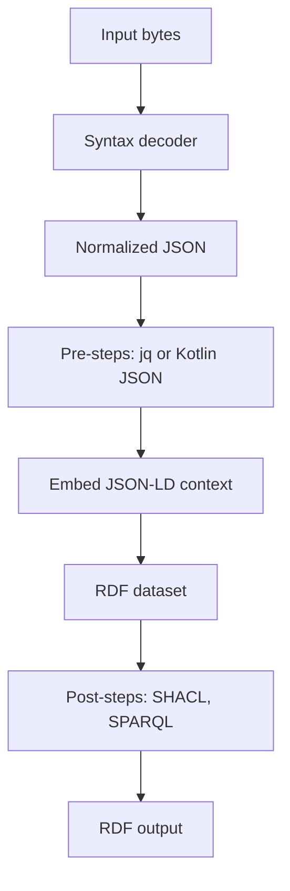

SemLift is a two-stage pipeline: **syntax decoding** produces normalized JSON, and **semantic lifting** produces RDF using a JSON-LD context plus optional validation and enrichment.

## End-to-end flow

## Deterministic stages

1. **Decode**: JSON/XML/CSV/JDBC are converted into a predictable JSON document.
2. **Pre-steps**: optional data shaping via `jq` or Kotlin JSON transforms.
3. **Context embed**: JSON-LD context defines identifiers, types, and predicates.
4. **RDF conversion**: JSON-LD is parsed into RDF (Jena or RDF4J backend).
5. **Post-steps**: SHACL validation and SPARQL rules transform or validate RDF.

## Performance considerations

- Decoding is linear in input size; JDBC uses paging with a configurable fetch size.
- `jq` pre-steps execute as external processes; keep them small and deterministic.
- SHACL validation and SPARQL rules are the dominant cost for large graphs.

